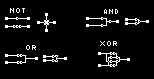

# Bitmap Logic Simulator (Web Version)

This is a web version of the Bitmap Logic Simulator, originally invented by [realhet](https://realhet.wordpress.com/author/realhet/) and posted on [HetPas](https://realhet.wordpress.com/2015/09/02/bitmap-logic-simulator/). The original version is written in Delphi XE.

The project is a simple web application using Vue.js. Users can upload their own bitmap images, with simple patterns that represent wires, NOT gates, and intersections. Take a look at the following image for how to implement basic logic gates.

*Project created by David Wang for the second BIBS-C Network Hackathon*
